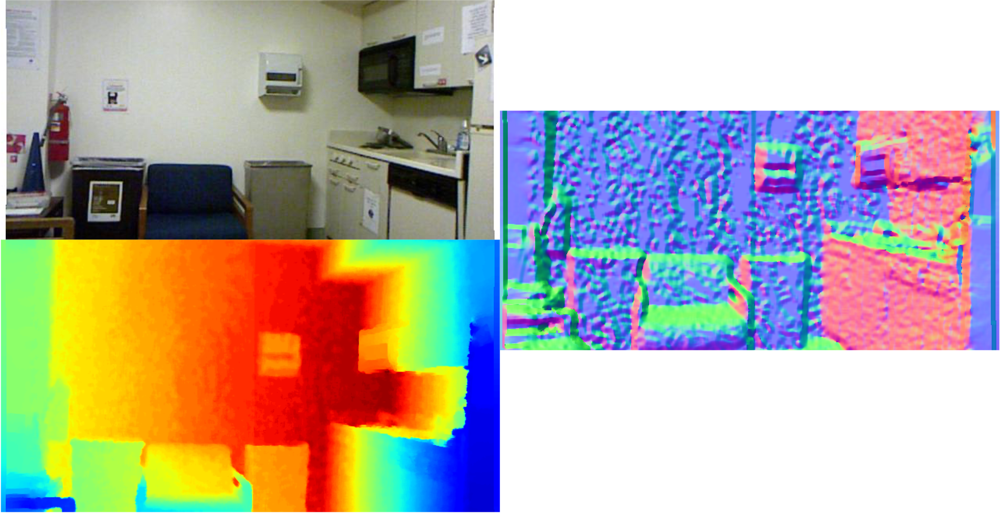

# Surface Normal
**Author** [YouminZhang](https://youmi-zym.github.io/)

This is a toolbox used to compute surface normal from a depth map.

<p align="center">

</p>

# Method
Our surface normal method is mainly based on plane fitting. Therefore, not only dense but sparse are both covered in our case.
As for proof of plane fitting, please refer to [least square](https://www.notion.so/Plane-Fitting-09c8cbf14d2044b7b00614e7630798e5) for details.
Following parameters are required:
```c++
float focal length;
float cx, cy;
int WINDOWSIZE; // for nearby valid 3D points searching
float Threshold; // the max allowed depth difference between nearby 3D points 
```

## How to read the surface normal value from image
In our code, for better visualization, we convert the real surface normal (nx, ny, nz) to picture as follows:
```c++
// For 3 Channles in saved Image(imgx, imgy, imgz): 
1st Channel: imgx = (nx + 1) * 255.0 / 2.0
2nd Channel: imgy = (ny + 1) * 255.0 / 2.0
3rd Channel: imgz = (nz + 1) * 255.0 / 2.0

// To get the real surface normal from Image:
nx = imgx * 2.0 / 255.0 -1
ny = imgy * 2.0 / 255.0 -1
nz = imgz * 2.0 / 255.0 -1
```

# Prerequisites
## OpenCV
We use OpenCV to manipulate images and features. Dowload and install instructions can be found at: http://opencv.org. Required at leat 3.0. Tested with OpenCV 4.5.0.

# Building surface normal toolbox
Clone the repository:
```bash
git clone https://github.com/youmi-zym/surface_normal
```
Build: we provide a script [build.sh](./build.sh) to build the toolbox.
```bash
cd surface_normal
chmod +x build.sh
./build.sh
```

# NYUDV2 Example
```bash
./build/surface_normal nyudv2 ./asserts/depth.png ./asserts/sn_nyudv2.png 1000.0
```

# More Example
for other datasets, such as KITTI2015, KITTI2012, ScanNet, we provide a script [run.sh](./run.sh) here. Refactor it to your style.
```bash
./run.sh
```

# Acknowledgement
Code is mainly adopted from [Cindy-xdZhang](https://github.com/Cindy-xdZhang/surface-normal) and [JiaXiong Qiu: DeepLidar](https://github.com/JiaxiongQ/DeepLiDAR).
